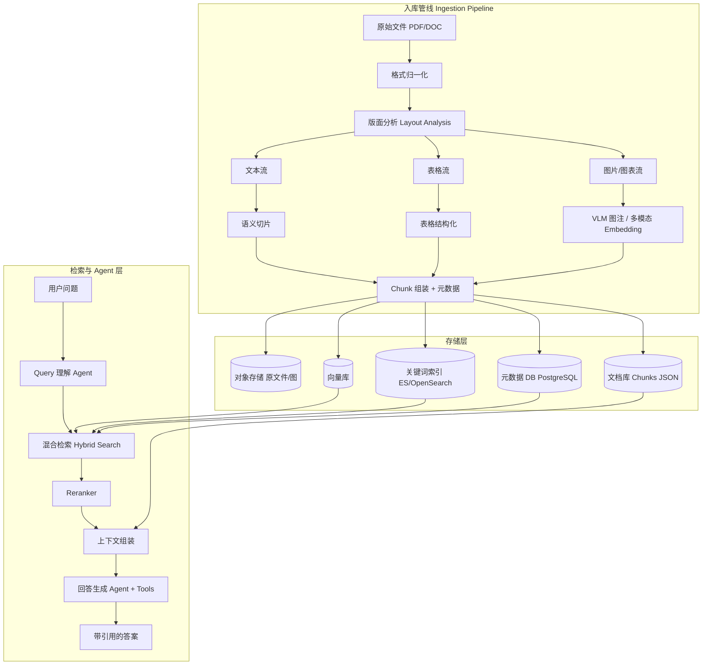
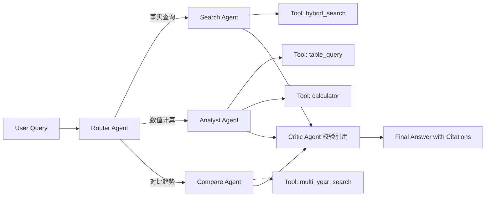
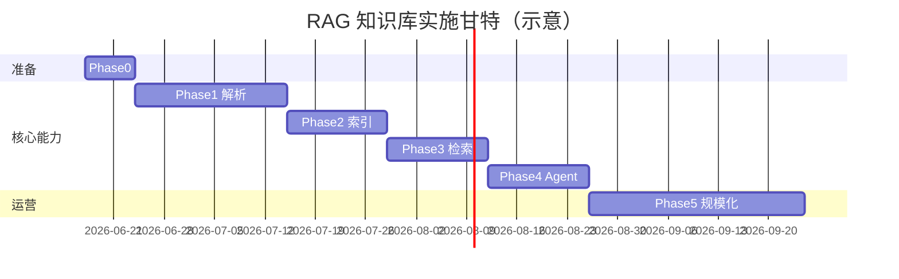

# 企业级年报查询系统 — RAG 知识库技术细节与规划

> 与《01-注意事项.md》配套。本文描述推荐技术架构、模块划分、数据模型、实施路线与选型对比。  
> 设计原则：**解析质量优先、多模态同等对待、检索可解释、Agent 可编排、企业可运维**。

---

## 一、总体架构

### 1.1 逻辑架构图



### 1.2 技术分层

| 层级 | 职责 | 本阶段产出 |
|------|------|------------|
| **L0 数据接入** | 文件上传、校验、去重、版本登记 | 批处理 CLI / 定时任务 |
| **L1 文档理解** | 版面、OCR、表、图解析 | 统一 ParsedDocument JSON |
| **L2 索引构建** | 切片、Embedding、倒排索引 | 可重建的索引任务 |
| **L3 检索服务** | 混合检索、过滤、Rerank | REST/gRPC API |
| **L4 Agent 编排** | 多步推理、工具调用、引用 | LangGraph / 同类框架 PoC |
| **L5 评估运维** | 基准集、监控、重跑 | 评估脚本 + Dashboard 可选 |

---

## 二、文档解析管线（核心）

### 2.1 格式归一化

```
DOC/DOCX ──► LibreOffice / Aspose 无头转换 ──► PDF
PDF ───────► 直接进入版面分析
扫描 PDF ──► OCR 层（见 2.3）
```

**中间产物**：`normalized.pdf` + `manifest.json`（页数、是否扫描、语言猜测）

### 2.2 版面分析与元素分类

推荐使用 **具备版面理解能力的解析器**，而非简单文本抽取：

| 工具 | 特点 | 适用 |
|------|------|------|
| **Docling** (IBM) | 开源、版面+表+导出 MD | 优先评估 |
| **MinerU** | 中文 PDF 友好、学术/财报版式 | 中文年报备选 |
| **Unstructured.io** | 分区 element 类型丰富 | 快速原型 |
| **Azure Document Intelligence** | 企业 SLA、表格强 | 有预算的商用 |
| **PaddleOCR + PP-Structure** | 中文 OCR+版面 | 私有化、扫描件 |

**输出统一 schema**（示意）：

```json
{
  "doc_id": "uuid",
  "pages": [
    {
      "page_no": 1,
      "elements": [
        {
          "element_id": "p1_e3",
          "type": "title | paragraph | table | figure | list | header | footer",
          "bbox": [x0, y0, x1, y1],
          "text": "...",
          "reading_order": 3,
          "children": []
        }
      ]
    }
  ]
}
```

### 2.3 OCR 策略

检测路径：

1. 抽样检测文本层字符数 / 页
2. 低于阈值 → 标记 `is_scanned=true`
3. 扫描件：整页 OCR，保留 **行/块级 bbox** 供溯源

双路校验（可选）：对含大量数字的页面，两路 OCR 结果 diff 超阈值 → 进入人工复核队列。

### 2.4 表格解析技术细节

**流水线**：

```
Table Region Detect ──► Structure Recognize ──► Cell OCR/Text ──► Post-process
                              │
                              ├──► Markdown 表（检索、展示）
                              └──► Table JSON（计算、校验）

Table JSON 示例：
{
  "table_id": "t_42_1",
  "caption": "合并利润表",
  "unit": "万元",
  "currency": "CNY",
  "headers": [["项目", "2023年", "2022年"]],
  "rows": [
    ["营业收入", "1476.94", "1275.54"],
    ["净利润", "747.34", "627.16"]
  ],
  "source": { "page": 42, "bbox": [...] }
}
```

**后处理规则**：

- 合并跨页表：根据表头相似度 + 续表关键词（「续表」「（续）」）
- 数字清洗：千分位、括号表示负数、单位统一到元
- 附注编号关联：`附注五、1` 与正文交叉引用建 `ref_links`

### 2.5 图片与图表解析

**分类器**（轻量 CNN 或规则）：

- `decorative` → 跳过内容索引
- `chart` / `diagram` / `photo` → 进入多模态管线

**图表处理双写**：

| 通道 | 内容 | 用途 |
|------|------|------|
| 文本通道 | VLM 生成：`标题 + 类型 + 轴说明 + 关键结论 + 数据摘要` | BM25 + 文本向量 |
| 向量通道 | 多模态 Embedding（原图或裁剪图） | 以图搜图、图文混检 |
| 结构化通道 | 若能从图反表（ChartOCR / DePlot 类） | 数值问答 |

推荐 VLM（按部署条件择一）：GPT-4o / Qwen-VL / InternVL；私有化优先 Qwen-VL 系列。

### 2.6 语义切片算法

**按元素类型分支**：

```python
# 伪代码逻辑
for element in reading_order(elements):
    if element.type == "paragraph":
        chunks += semantic_split(element.text, max_tokens=512, overlap=64)
    elif element.type == "table":
        chunks += [whole_table_chunk] or row_group_split(table, keep_header=True)
    elif element.type == "figure":
        chunks += [figure_chunk_with_caption_and_vlm_summary]
    elif element.type == "title":
        update_section_stack(element)  # 写入元数据，不一定单独成块
```

**Parent-Child 索引**：

- **Child**：512 tokens 左右，用于检索
- **Parent**：章节级或整表，用于 LLM 上下文回填
- 关联字段：`parent_chunk_id`

**可选高级技术**：

- **Late Chunking**（Jina 等）：先长文 Embedding 再切，提升长文语义连贯性
- **Contextual Retrieval**（Anthropic）：切片时把 `文档标题 + 章节路径` 拼入 Embedding 文本

---

## 三、索引与存储设计

### 3.1 存储组件选型

| 组件 | 推荐 | 说明 |
|------|------|------|
| 对象存储 | MinIO / S3 | 原文件、页图、裁剪图表 |
| 文档 Chunk 库 | PostgreSQL + JSONB | 主数据、关系、版本 |
| 向量库 | Qdrant / Milvus / pgvector | 按规模选型；百万级 Chunk Qdrant 够用 |
| 全文检索 | OpenSearch / Elasticsearch | BM25、高亮、聚合过滤 |
| 缓存 | Redis | Query 向量缓存、热点 Chunk |
| 任务队列 | Celery + Redis / Temporal | 长耗时解析异步化 |

**小规模 PoC 极简组合**：PostgreSQL（JSONB + pgvector）+ MinIO，减少运维组件。

### 3.2 Chunk 数据模型（PostgreSQL）

```sql
-- 文档登记
CREATE TABLE documents (
    doc_id          UUID PRIMARY KEY,
    company_id      VARCHAR(32) NOT NULL,
    fiscal_year     INT NOT NULL,
    report_type     VARCHAR(16) NOT NULL,
    source_filename TEXT NOT NULL,
    source_hash     CHAR(64) NOT NULL UNIQUE,
    storage_uri     TEXT NOT NULL,
    parse_status    VARCHAR(16) DEFAULT 'pending',
    parse_version   VARCHAR(16),
    created_at      TIMESTAMPTZ DEFAULT NOW()
);

-- 切片主表
CREATE TABLE chunks (
    chunk_id        UUID PRIMARY KEY,
    doc_id          UUID REFERENCES documents(doc_id),
    parent_chunk_id UUID REFERENCES chunks(chunk_id),
    chunk_type      VARCHAR(16) NOT NULL,  -- text/table/figure
    content_text    TEXT,                   -- 检索用主文本
    content_md      TEXT,                   -- 展示用
    table_json      JSONB,                  -- 表结构
    figure_uri      TEXT,                   -- 图片地址
    metadata        JSONB NOT NULL,         -- section_path, pages, etc.
    token_count     INT,
    embedding_id    VARCHAR(64),            -- 向量库中的 id
    created_at      TIMESTAMPTZ DEFAULT NOW()
);

CREATE INDEX idx_chunks_doc ON chunks(doc_id);
CREATE INDEX idx_chunks_company_year ON chunks((metadata->>'company_id'), (metadata->>'fiscal_year'));
CREATE INDEX idx_chunks_type ON chunks(chunk_type);
```

### 3.3 向量与关键词双索引

每条 Chunk 写入时：

1. `content_text` = 正文 + 章节路径前缀 + 表头摘要（提升检索）
2. 生成 Embedding → 向量库（可按 `company_id` 或 `fiscal_year` 设 Payload 过滤）
3. `content_text` 同步到 OpenSearch（IK 分词器 / smartcn + 财经自定义词典）
4. 表格额外索引：行名、列名、关键科目作为 boost 字段

**Embedding 模型建议**：

| 场景 | 模型 |
|------|------|
| 中文为主 | `bge-m3`（稠密+稀疏一体）、`jina-embeddings-v3` |
| 中英混合年报 | `bge-m3` 或 `text-embedding-3-large` |
| 多模态 | `bge-visualized` / CLIP 变体 / 厂商多模态 API |

### 3.4 混合检索公式（示例）

```
final_score = α * cosine(query_vec, doc_vec)
            + β * bm25(query, content_text)
            + γ * metadata_match_boost(company, year, section)
```

- 粗召回：向量 Top-50 + BM25 Top-50 → 去重合并
- 精排：Cross-Encoder Reranker（`bge-reranker-v2-m3` 或 Cohere Rerank）
- 输出 Top-8~12 进入 Agent 上下文窗口

---

## 四、Agent 编排设计（最新 Agent 技术）

### 4.1 为何用 Agent

年报问答 ≠ 单次检索 + 单次生成。典型需要：

1. **查询分解**：「近三年研发费用变化」→ 3 次按年检索 + 聚合
2. **工具调用**：计算器、表 JSON 查询、SQL-like 结构化查询
3. **自我校验**：答案数字回源表核对
4. **引用组装**：每个事实绑定 `chunk_id` 与页码

### 4.2 推荐框架

| 框架 | 特点 |
|------|------|
| **LangGraph** | 有状态图、可循环、适合多步 RAG，生态成熟 |
| **LlamaIndex Workflows** | 与 RAG 组件贴合紧 |
| **OpenAI Agents SDK / Swarm 类** | 轻量多 Agent 分工 |
| **MCP (Model Context Protocol)** | 检索、计算、DB 以标准工具暴露，便于换模型 |

本方案推荐：**LangGraph + MCP 工具层**。

### 4.3 Agent 拓扑（示意）



### 4.4 工具清单（MCP Servers）

| 工具名 | 功能 |
|--------|------|
| `search_annual_report` | 混合检索 + 元数据过滤 |
| `get_chunk_detail` | 按 chunk_id 取 Parent 上下文 |
| `query_financial_table` | 对 table_json 按科目/年份查询 |
| `list_sections` | 列出某公司某年章节树 |
| `compare_metrics` | 跨年指标对比（封装检索+计算） |
| `get_figure` | 返回图片 URL + 图注 |

### 4.5 Prompt 与流程控制

- **Router**：判断问题类型，抽取 `company`、`years`、`metrics`、`section` 实体
- **Search Agent**：必须先调用检索工具再回答；禁止无引用陈述
- **Critic**：检查回答中每个数字是否出现在返回 Chunk 中
- **最大步数**：5~8 步，防止 Agent 循环
- **流式输出**：后期网站用；PoC 可同步

### 4.6 与「最新 Agent 技术」的对应关系

| 技术点 | 在本项目中的落点 |
|--------|------------------|
| Agentic RAG | 多步检索、查询改写、结果校验 |
| MCP | 检索/表查询/计算工具标准化 |
| Multi-Agent | Router + Specialist + Critic 分工 |
| Structured Output | 工具参数与最终回答 JSON Schema |
| Context Engineering | Parent Chunk 回填、章节路径前缀 |
| Eval-driven | 用 RAGAS/DeepEval 驱动迭代 |

---

## 五、项目目录结构（建议）

```
annual-report-rag/
├── docs/                          # 设计文档（本目录）
├── pipelines/
│   ├── ingest/                    # 入库入口
│   ├── normalize/                 # DOC→PDF 等
│   ├── parse/                     # Docling/MinerU 适配器
│   ├── ocr/                       # OCR 封装
│   ├── chunk/                     # 切片策略
│   └── index/                     # 写向量库+ES
├── schemas/                       # ParsedDocument, Chunk, Table JSON
├── storage/                       # 存储抽象（MinIO, PG, Qdrant）
├── retrieval/
│   ├── hybrid_search.py
│   ├── reranker.py
│   └── filters.py
├── agents/
│   ├── graph.py                   # LangGraph 定义
│   ├── nodes/                     # router, search, critic
│   └── tools/                     # MCP tools
├── api/                           # 后期 FastAPI，现阶段可空
├── eval/
│   ├── datasets/                  # 问题+期望引用
│   └── run_eval.py
├── configs/
│   ├── models.yaml
│   └── pipelines.yaml
└── scripts/
    ├── batch_ingest.py
    └── reindex.py
```

---

## 六、实施路线图

### Phase 0：准备（1 周）

- [ ] 收集 20~50 份样本年报（文本 PDF、扫描 PDF、DOC 各占比）
- [ ] 确定部署约束：纯内网 / 混合云 / 公有云
- [ ] 选定 LLM、Embedding、VLM（含 API Key 或私有化权重）
- [ ] 编写 50 条标注问答测试集（含页码 ground truth）

### Phase 1：解析 PoC（2~3 周）

- [ ] 对比 Docling vs MinerU vs 商用 API 在样本上的表/版式效果
- [ ] 定稿 `ParsedDocument` schema
- [ ] 实现表格 JSON 双写与跨页合并 v1
- [ ] 扫描件 OCR 流水线 + 低置信页标记
- [ ] **里程碑**：单份年报解析为结构化 JSON，人工抽检通过

### Phase 2：切片与索引（2 周）

- [ ] 实现分类型切片 + Parent-Child
- [ ] 接入 pgvector/Qdrant + OpenSearch（或 PG 全文）
- [ ] 批量入库脚本 `batch_ingest.py`
- [ ] **里程碑**：样本库可关键词+语义检索到正确章节

### Phase 3：检索增强（1~2 周）

- [ ] 混合检索 + Reranker
- [ ] 元数据过滤（公司、年份、章节）
- [ ] 检索 API（FastAPI 单端点即可）
- [ ] **里程碑**：Recall@5 达内部目标

### Phase 4：Agent PoC（2 周）

- [ ] LangGraph 编排 + 工具调用
- [ ] 引用溯源格式统一
- [ ] Critic 数字校验 v1
- [ ] **里程碑**：测试集 80% 事实题带正确引用

### Phase 5：质量与规模化（持续）

- [ ] 全量年报批处理与失败重试
- [ ] 解析版本升级与重索引
- [ ] 监控、成本报表、人工复核后台（简易即可）
- [ ] 为后续网站预留 REST API 契约



---

## 七、技术选型汇总表

| 类别 | 首选 | 备选 |
|------|------|------|
| 语言 | Python 3.11+ | — |
| PDF 版面解析 | Docling | MinerU, Azure DI |
| OCR | PaddleOCR | Tesseract, 云 OCR |
| DOC 转换 | LibreOffice Headless | Aspose |
| 切片 | 自研分类型 + Parent-Child | LlamaIndex NodeParser |
| Embedding | bge-m3 | jina-v3, openai embedding |
| 向量库 | Qdrant | Milvus, pgvector |
| 全文检索 | OpenSearch | Elasticsearch |
| Reranker | bge-reranker-v2-m3 | Cohere Rerank |
| LLM | 按合规选 Qwen2.5 / GPT-4o | DeepSeek, Claude |
| VLM | Qwen-VL | GPT-4o vision |
| Agent | LangGraph | LlamaIndex Workflow |
| 工具协议 | MCP | 原生 function calling |
| 任务队列 | Celery | Temporal |
| API（后期） | FastAPI | — |
| 评估 | RAGAS + 自建引用校验 | DeepEval |

---

## 八、接口预留（供未来网站对接）

当前不实现前端，但建议提前定义检索 API 契约：

### `POST /api/v1/search`

```json
// Request
{
  "query": "贵州茅台2023年研发费用是多少",
  "filters": {
    "company_id": "600519.SH",
    "fiscal_years": [2023],
    "chunk_types": ["text", "table"]
  },
  "top_k": 10,
  "rerank": true
}

// Response
{
  "chunks": [
    {
      "chunk_id": "uuid",
      "score": 0.92,
      "chunk_type": "table",
      "content_preview": "...",
      "metadata": { "section": "...", "page_start": 156 },
      "citation": "贵州茅台2023年年报，第三节，第156页"
    }
  ]
}
```

### `POST /api/v1/ask`（Agent）

```json
// Response 关键字段
{
  "answer": "...",
  "citations": [
    { "chunk_id": "uuid", "page": 156, "excerpt": "..." }
  ],
  "steps": [ /* 可选：Agent 推理步骤，便于调试 */ ],
  "confidence": "high"
}
```

---

## 九、评估指标与数据集构建

### 9.1 检索层

- Recall@K、MRR、NDCG
- 按问题类型分层：事实型 / 表格数值 / 跨章对比 / 图表型

### 9.2 生成层（Agent）

- **Citation Accuracy**：引用是否支持答案
- **Number Exact Match**：数值与源表一致率
- **Hallucination Rate**：无源陈述比例

### 9.3 解析层

- 表格单元格 F1
- 章节标题层级准确率
- OCR 字符错误率（CER）于数字区域

---

## 十、环境与部署建议

| 环境 | 配置参考 |
|------|----------|
| 开发机 | 16GB+ RAM；解析 GPU 可选 |
| 解析 Worker | GPU（VLM/OCR）+ 多进程 CPU |
| 向量/检索 | 16GB+ 内存独立节点 |
| 模型服务 | vLLM / Ollama 部署本地 LLM；或 API |

**Docker Compose** 建议服务：`postgres`、`minio`、`qdrant`、`opensearch`、`redis`、`api`、`worker`。

---

## 十一、下一步行动（立即可做）

1. 准备 **30 份** 多样本年报样本放入 `data/raw/`
2. 用 Docling / MinerU 各跑 5 份，对比表格与章节效果，**书面结论定解析器**
3. 冻结 v0.1 版 `ParsedDocument` 与 `Chunk` schema（可放 `schemas/`）
4. 编写 50 条测试问答 JSON（`eval/datasets/qa_v0.json`）
5. 实现 `batch_ingest.py` 最小闭环：PDF → 解析 → 切片 → pgvector

---

*文档版本：v0.1 | 与《01-注意事项.md》配套 | 网站层待知识库验收后启动*
